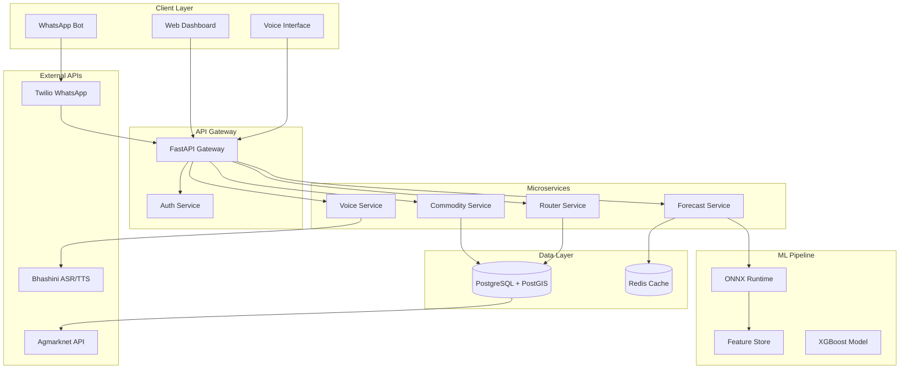

# Backend Implementation Plan - Code Ready

## Executive Summary

This plan outlines the step-by-step implementation of the Agri-Analytics Platform backend. The backend serves as the core engine powering price forecasting, mandi recommendations, voice processing, and WhatsApp bot integration for Indian farmers.

---

## Architecture Overview



---

## Implementation Phases

### Phase 1: Foundation - Project Structure and Configuration

**Files to Create:**
```
backend/
├── app/
│   ├── __init__.py
│   ├── main.py                    # FastAPI app entry point
│   ├── config.py                  # Environment configuration
│   └── dependencies.py            # Dependency injection
├── requirements.txt               # Updated dependencies
└── README.md
```

**Key Implementation:**
- [x] Analyze documentation
- [ ] Create directory structure
- [ ] Set up Pydantic Settings for configuration
- [ ] Update requirements.txt with all dependencies

### Phase 2: Database Layer

**Files to Create:**
```
backend/
├── app/
│   ├── models/
│   │   ├── __init__.py
│   │   ├── base.py                # SQLAlchemy base
│   │   ├── commodity.py
│   │   ├── mandi.py
│   │   ├── price.py
│   │   ├── weather.py
│   │   ├── user.py
│   │   └── alert.py
│   └── database.py                # Database connection
├── alembic/
│   ├── versions/
│   └── env.py
```

**Database Schema:**
- `mandis` - Market locations with PostGIS geospatial data
- `commodities` - Agricultural commodities catalog
- `prices` - Historical price data (TimescaleDB hypertable candidate)
- `weather` - Weather observations
- `users` - User accounts for WhatsApp/auth
- `alerts` - Price alert configurations

### Phase 3: Core Security and Schemas

**Files to Create:**
```
backend/
├── app/
│   ├── core/
│   │   ├── __init__.py
│   │   ├── security.py            # JWT handling
│   │   ├── exceptions.py          # Custom exceptions
│   │   └── cache.py               # Redis utilities
│   └── api/
│       └── v1/
│           └── schemas/
│               ├── auth.py
│               ├── commodity.py
│               ├── mandi.py
│               ├── forecast.py
│               └── voice.py
```

### Phase 4: API Endpoints

**Files to Create:**
```
backend/
├── app/
│   ├── api/
│   │   └── v1/
│   │       ├── router.py          # API router aggregator
│   │       └── endpoints/
│   │           ├── auth.py
│   │           ├── commodities.py
│   │           ├── mandis.py
│   │           ├── forecasts.py
│   │           ├── routing.py
│   │           └── voice.py
```

**API Endpoints:**
| Method | Endpoint | Description |
|--------|----------|-------------|
| POST | `/api/v1/auth/register` | Register new user |
| POST | `/api/v1/auth/login` | Login and get JWT |
| GET | `/api/v1/commodities` | List all commodities |
| GET | `/api/v1/mandis` | List all mandis |
| GET | `/api/v1/mandis/nearby` | Find mandis within radius |
| GET | `/api/v1/forecasts/predict` | Get price forecast |
| GET | `/api/v1/forecasts/explain` | Get SHAP explanation |
| POST | `/api/v1/routing/optimal` | Find best mandi |
| POST | `/api/v1/voice/transcribe` | Speech to text |
| POST | `/api/v1/webhook/whatsapp` | WhatsApp webhook |

### Phase 5: Business Services

**Files to Create:**
```
backend/
├── app/
│   ├── services/
│   │   ├── __init__.py
│   │   ├── commodity_service.py
│   │   ├── forecast_service.py
│   │   ├── routing_service.py
│   │   ├── voice_service.py
│   │   └── whatsapp_service.py
```

### Phase 6: ML Pipeline

**Files to Create:**
```
backend/
├── app/
│   ├── ml/
│   │   ├── __init__.py
│   │   ├── feature_engineering.py
│   │   ├── xgb_forecast.py        # XGBoost short-term
│   │   ├── explainer.py           # SHAP explanations
│   │   └── model_loader.py        # ONNX model loading
```

### Phase 7: Data Ingestion

**Files to Create:**
```
backend/
├── app/
│   └── ingestion/
│       ├── __init__.py
│       ├── agmarknet_scraper.py
│       ├── weather_fetcher.py
│       └── pipeline.py            # Prefect flows
```

### Phase 8: Infrastructure

**Files to Create:**
```
backend/
├── docker/
│   ├── Dockerfile
│   └── docker-compose.yml
├── tests/
│   ├── conftest.py
│   ├── test_api/
│   └── test_ml/
```

---

## Dependencies

```txt
# Core
fastapi==0.109.0
uvicorn[standard]==0.27.0
pydantic==2.5.3
pydantic-settings==2.1.0

# Database
sqlalchemy==2.0.25
asyncpg==0.29.0
alembic==1.13.1
geoalchemy2==0.14.2
shapely==2.0.2

# Cache
redis==5.0.1

# Security
python-jose[cryptography]==3.3.0
passlib[bcrypt]==1.7.4
python-multipart==0.0.6

# HTTP
httpx==0.26.0

# Data Processing
beautifulsoup4==4.12.3
lxml==5.1.0
pandas==2.1.4
numpy==1.26.3

# ML
xgboost==2.0.3
onnxruntime==1.16.3
shap==0.44.1

# Orchestration
prefect==2.14.20

# Storage
minio==7.2.3

# Integrations
twilio==8.12.0
```

---

## Execution Order

1. **Create project structure** - All directories and `__init__.py` files
2. **Update requirements.txt** - Add all dependencies
3. **Implement config.py** - Pydantic Settings configuration
4. **Create database.py** - SQLAlchemy async engine setup
5. **Implement models** - All SQLAlchemy models
6. **Create Alembic migrations** - Database schema
7. **Implement core security** - JWT and password hashing
8. **Create Pydantic schemas** - Request/response models
9. **Implement services** - Business logic layer
10. **Create API endpoints** - FastAPI routers
11. **Implement ML modules** - Feature engineering and forecasting
12. **Create ingestion pipeline** - Data scrapers and Prefect flows
13. **Add Docker configuration** - Containerization
14. **Write tests** - Unit and integration tests

---

## Success Metrics

| Metric | Target |
|--------|--------|
| API Response Time | < 200ms (p95) |
| Forecast Accuracy | > 85% MAPE |
| System Uptime | 99.9% |
| Voice Transcription Accuracy | > 90% WER |
| WhatsApp Response Time | < 5s |
| Concurrent Users | 1000+ |
