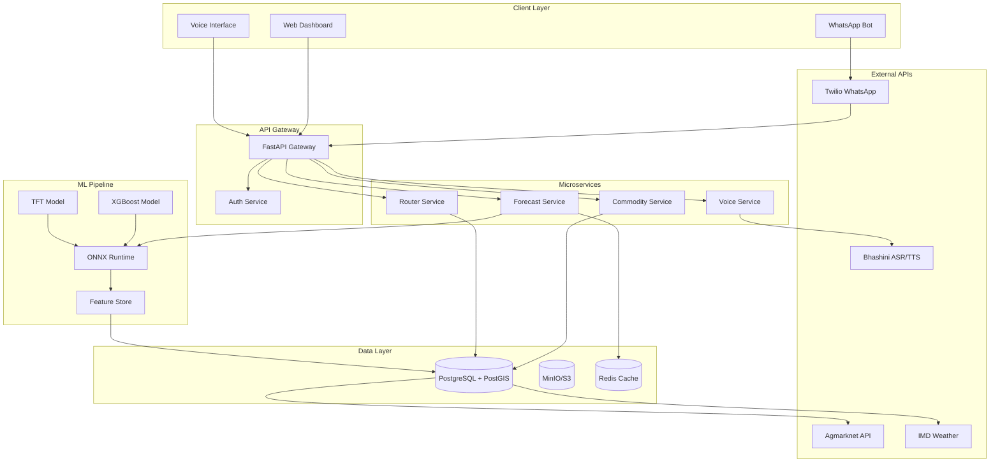
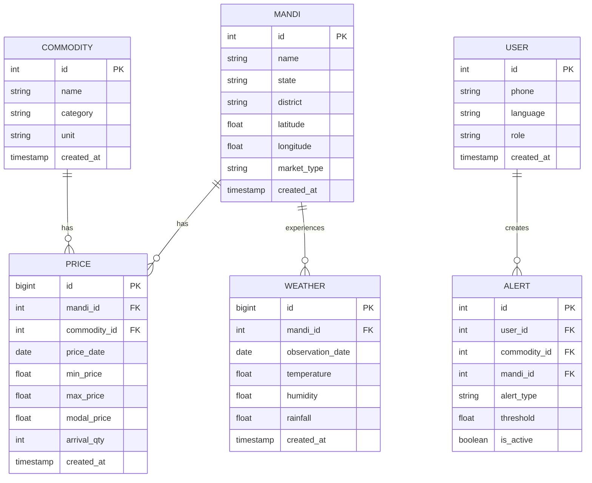
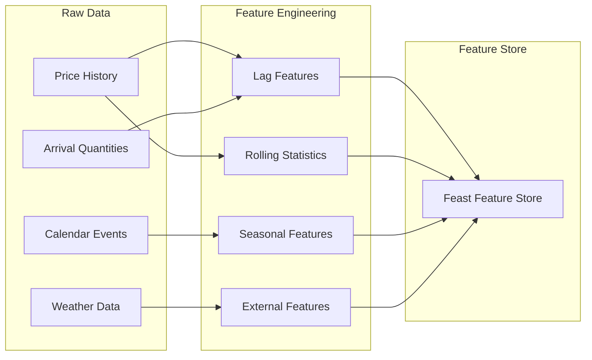

# Backend Implementation Plan: Agri-Analytics Platform

## Executive Summary

This document outlines the comprehensive implementation plan for the backend infrastructure of the Agricultural Analytics Platform. The backend serves as the core engine powering price forecasting, mandi recommendations, voice processing, and WhatsApp bot integration for Indian farmers.

---

## 1. System Architecture Overview

### 1.1 High-Level Architecture



### 1.2 Technology Stack Summary

| Layer | Technology | Purpose |
|-------|------------|---------|
| API Framework | FastAPI | Async REST API |
| Database | PostgreSQL + PostGIS | Relational + Geospatial |
| Cache | Redis | Response caching |
| Object Store | MinIO/S3 | Raw data files |
| ML Serving | ONNX Runtime | Fast inference |
| Orchestration | Prefect | Data pipelines |
| Auth | JWT + OAuth2 | Authentication |

---

## 2. Project Structure

```
backend/
├── app/
│   ├── __init__.py
│   ├── main.py                    # FastAPI app entry point
│   ├── config.py                  # Environment configuration
│   ├── dependencies.py            # Dependency injection
│   │
│   ├── api/
│   │   ├── __init__.py
│   │   ├── v1/
│   │   │   ├── __init__.py
│   │   │   ├── router.py          # API router aggregator
│   │   │   ├── endpoints/
│   │   │   │   ├── auth.py        # Authentication endpoints
│   │   │   │   ├── commodities.py # Commodity CRUD
│   │   │   │   ├── mandis.py      # Mandi endpoints
│   │   │   │   ├── forecasts.py   # Price predictions
│   │   │   │   ├── routing.py     # Optimal mandi logic
│   │   │   │   └── voice.py       # Voice processing
│   │   │   └── schemas/
│   │   │       ├── auth.py
│   │   │       ├── commodity.py
│   │   │       ├── mandi.py
│   │   │       ├── forecast.py
│   │   │       └── voice.py
│   │   └── middleware/
│   │       ├── rate_limit.py
│   │       └── logging.py
│   │
│   ├── core/
│   │   ├── __init__.py
│   │   ├── security.py            # JWT handling
│   │   ├── exceptions.py          # Custom exceptions
│   │   └── cache.py               # Redis utilities
│   │
│   ├── models/
│   │   ├── __init__.py
│   │   ├── base.py                # SQLAlchemy base
│   │   ├── commodity.py
│   │   ├── mandi.py
│   │   ├── price.py
│   │   ├── weather.py
│   │   └── user.py
│   │
│   ├── services/
│   │   ├── __init__.py
│   │   ├── commodity_service.py
│   │   ├── forecast_service.py
│   │   ├── routing_service.py
│   │   ├── voice_service.py
│   │   └── whatsapp_service.py
│   │
│   ├── ml/
│   │   ├── __init__.py
│   │   ├── feature_engineering.py
│   │   ├── xgb_forecast.py        # XGBoost short-term
│   │   ├── tft_forecast.py        # TFT long-term
│   │   ├── explainer.py           # SHAP explanations
│   │   └── model_loader.py        # ONNX model loading
│   │
│   └── ingestion/
│       ├── __init__.py
│       ├── agmarknet_scraper.py
│       ├── weather_fetcher.py
│       └── pipeline.py            # Prefect flows
│
├── tests/
│   ├── __init__.py
│   ├── conftest.py
│   ├── test_api/
│   │   ├── test_auth.py
│   │   ├── test_forecasts.py
│   │   └── test_routing.py
│   └── test_ml/
│       ├── test_features.py
│       └── test_models.py
│
├── alembic/                       # Database migrations
│   ├── versions/
│   └── env.py
│
├── docker/
│   ├── Dockerfile
│   └── docker-compose.yml
│
├── requirements.txt
├── requirements-dev.txt
├── pyproject.toml
└── README.md
```

---

## 3. Database Schema Design

### 3.1 Entity Relationship Diagram



### 3.2 SQL Schema Definition

```sql
-- Enable PostGIS extension
CREATE EXTENSION IF NOT EXISTS postgis;

-- Mandis table with geospatial data
CREATE TABLE mandis (
    id SERIAL PRIMARY KEY,
    name VARCHAR(255) NOT NULL,
    state VARCHAR(100) NOT NULL,
    district VARCHAR(100) NOT NULL,
    latitude DECIMAL(10, 8) NOT NULL,
    longitude DECIMAL(11, 8) NOT NULL,
    location GEOGRAPHY(POINT, 4326),
    market_type VARCHAR(50) DEFAULT 'Regulated',
    created_at TIMESTAMP DEFAULT CURRENT_TIMESTAMP,
    updated_at TIMESTAMP DEFAULT CURRENT_TIMESTAMP
);

-- Create spatial index
CREATE INDEX idx_mandis_location ON mandis USING GIST(location);

-- Commodities table
CREATE TABLE commodities (
    id SERIAL PRIMARY KEY,
    name VARCHAR(255) NOT NULL UNIQUE,
    category VARCHAR(100),
    unit VARCHAR(50) DEFAULT 'Quintal',
    created_at TIMESTAMP DEFAULT CURRENT_TIMESTAMP
);

-- Prices table (TimescaleDB hypertable candidate)
CREATE TABLE prices (
    id BIGSERIAL PRIMARY KEY,
    mandi_id INTEGER REFERENCES mandis(id) ON DELETE CASCADE,
    commodity_id INTEGER REFERENCES commodities(id) ON DELETE CASCADE,
    price_date DATE NOT NULL,
    min_price DECIMAL(12, 2),
    max_price DECIMAL(12, 2),
    modal_price DECIMAL(12, 2),
    arrival_qty INTEGER,
    created_at TIMESTAMP DEFAULT CURRENT_TIMESTAMP,
    UNIQUE(mandi_id, commodity_id, price_date)
);

-- Create indexes for common queries
CREATE INDEX idx_prices_date ON prices(price_date DESC);
CREATE INDEX idx_prices_mandi_commodity ON prices(mandi_id, commodity_id);
CREATE INDEX idx_prices_commodity_date ON prices(commodity_id, price_date DESC);

-- Weather data table
CREATE TABLE weather (
    id BIGSERIAL PRIMARY KEY,
    mandi_id INTEGER REFERENCES mandis(id) ON DELETE CASCADE,
    observation_date DATE NOT NULL,
    temperature DECIMAL(5, 2),
    humidity DECIMAL(5, 2),
    rainfall DECIMAL(8, 2),
    created_at TIMESTAMP DEFAULT CURRENT_TIMESTAMP
);

-- Users table for WhatsApp/Auth
CREATE TABLE users (
    id SERIAL PRIMARY KEY,
    phone VARCHAR(20) UNIQUE NOT NULL,
    language VARCHAR(10) DEFAULT 'en',
    role VARCHAR(20) DEFAULT 'farmer',
    is_active BOOLEAN DEFAULT TRUE,
    created_at TIMESTAMP DEFAULT CURRENT_TIMESTAMP
);

-- Price alerts
CREATE TABLE alerts (
    id SERIAL PRIMARY KEY,
    user_id INTEGER REFERENCES users(id) ON DELETE CASCADE,
    commodity_id INTEGER REFERENCES commodities(id),
    mandi_id INTEGER REFERENCES mandis(id),
    alert_type VARCHAR(50) CHECK (alert_type IN ('above', 'below')),
    threshold DECIMAL(12, 2),
    is_active BOOLEAN DEFAULT TRUE,
    created_at TIMESTAMP DEFAULT CURRENT_TIMESTAMP
);
```

---

## 4. API Endpoints Specification

### 4.1 Authentication Endpoints

| Method | Endpoint | Description |
|--------|----------|-------------|
| POST | `/api/v1/auth/register` | Register new user |
| POST | `/api/v1/auth/login` | Login and get JWT |
| POST | `/api/v1/auth/refresh` | Refresh access token |
| POST | `/api/v1/auth/otp/send` | Send OTP via WhatsApp |

### 4.2 Commodity & Mandi Endpoints

| Method | Endpoint | Description |
|--------|----------|-------------|
| GET | `/api/v1/commodities` | List all commodities |
| GET | `/api/v1/commodities/{id}` | Get commodity details |
| GET | `/api/v1/commodities/search` | Search commodities by name |
| GET | `/api/v1/mandis` | List all mandis |
| GET | `/api/v1/mandis/{id}` | Get mandi details |
| GET | `/api/v1/mandis/nearby` | Find mandis within radius |

### 4.3 Price & Forecast Endpoints

| Method | Endpoint | Description |
|--------|----------|-------------|
| GET | `/api/v1/prices/current` | Get current prices |
| GET | `/api/v1/prices/history` | Get historical prices |
| GET | `/api/v1/forecasts/predict` | Get price forecast |
| GET | `/api/v1/forecasts/explain` | Get SHAP explanation |

### 4.4 Routing & Optimization Endpoints

| Method | Endpoint | Description |
|--------|----------|-------------|
| POST | `/api/v1/routing/optimal` | Find best mandi |
| GET | `/api/v1/routing/compare` | Compare mandis |

### 4.5 Voice & WhatsApp Endpoints

| Method | Endpoint | Description |
|--------|----------|-------------|
| POST | `/api/v1/voice/transcribe` | Speech to text |
| POST | `/api/v1/voice/synthesize` | Text to speech |
| POST | `/api/v1/webhook/whatsapp` | WhatsApp webhook |
| POST | `/api/v1/webhook/voice` | Voice query webhook |

---

## 5. ML Pipeline Implementation

### 5.1 Feature Engineering Pipeline



### 5.2 Model Architecture

#### Short-Term Forecasting (1-7 days): XGBoost

```python
# ml/xgb_forecast.py
from xgboost import XGBRegressor
import onnxruntime as ort

class XGBForecaster:
    def __init__(self, model_path: str):
        self.session = ort.InferenceSession(model_path)
    
    def predict(self, features: dict) -> dict:
        # Prepare input tensor
        input_array = self._prepare_features(features)
        
        # Run inference
        outputs = self.session.run(None, {"input": input_array})
        
        return {
            "prediction": float(outputs[0][0]),
            "confidence_interval": self._calculate_ci(outputs)
        }
    
    def _prepare_features(self, features: dict) -> np.ndarray:
        # Feature ordering must match training
        feature_order = [
            "lag_1", "lag_7", "lag_30",
            "rolling_mean_7", "rolling_std_7",
            "day_of_week", "month", "is_holiday",
            "temperature", "rainfall", "arrival_qty"
        ]
        return np.array([[features.get(f, 0) for f in feature_order]])
```

#### Long-Term Forecasting (1-3 months): Temporal Fusion Transformer

```python
# ml/tft_forecast.py
import torch
from pytorch_forecasting import TemporalFusionTransformer

class TFTForecaster:
    def __init__(self, model_path: str):
        self.model = self._load_model(model_path)
        self.model.eval()
    
    def predict(self, time_series: pd.DataFrame, horizon: int = 90) -> dict:
        with torch.no_grad():
            predictions = self.model.predict(time_series, mode="quantiles")
        
        return {
            "predictions": predictions["0.5"].tolist(),
            "lower_bound": predictions["0.1"].tolist(),
            "upper_bound": predictions["0.9"].tolist(),
            "attention_weights": self._get_attention()
        }
    
    def _get_attention(self) -> dict:
        # Extract interpretability
        return {
            "static_weights": self.model.static_weights,
            "temporal_weights": self.model.temporal_weights
        }
```

### 5.3 Explainability with SHAP

```python
# ml/explainer.py
import shap

class PriceExplainer:
    def __init__(self, model, feature_names: list):
        self.explainer = shap.TreeExplainer(model)
        self.feature_names = feature_names
    
    def explain_prediction(self, features: dict, language: str = "en") -> dict:
        # Calculate SHAP values
        feature_array = self._dict_to_array(features)
        shap_values = self.explainer.shap_values(feature_array)
        
        # Get top contributing factors
        top_factors = self._get_top_factors(shap_values[0], n=3)
        
        # Generate natural language explanation
        explanation = self._generate_explanation(top_factors, language)
        
        return {
            "shap_values": shap_values[0].tolist(),
            "top_factors": top_factors,
            "natural_language": explanation
        }
    
    def _generate_explanation(self, factors: list, language: str) -> str:
        templates = {
            "en": "Price is {direction} because: {reasons}",
            "hi": "भाव {direction} है क्योंकि: {reasons}"
        }
        # Generate human-readable explanation
        reasons = self._format_reasons(factors, language)
        direction = "high" if factors[0]["impact"] > 0 else "low"
        return templates[language].format(direction=direction, reasons=reasons)
```

---

## 6. Data Ingestion Pipeline

### 6.1 Agmarknet Scraper

```python
# ingestion/agmarknet_scraper.py
import requests
from bs4 import BeautifulSoup
from datetime import date
import pandas as pd

class AgmarknetScraper:
    BASE_URL = "https://agmarknet.gov.in"
    
    def __init__(self):
        self.session = requests.Session()
        self.session.headers.update({
            "User-Agent": "Mozilla/5.0 (Windows NT 10.0; Win64; x64)",
            "Accept-Language": "en-US,en;q=0.9"
        })
    
    def fetch_daily_prices(self, state: str = None, date: date = None) -> pd.DataFrame:
        """Fetch daily commodity prices from Agmarknet"""
        params = self._build_params(state, date)
        response = self.session.get(f"{self.BASE_URL}/SearchCmmMkt", params=params)
        
        soup = BeautifulSoup(response.content, "html.parser")
        table = soup.find("table", {"id": "cmmMktTable"})
        
        return self._parse_table(table)
    
    def _parse_table(self, table) -> pd.DataFrame:
        data = []
        for row in table.find_all("tr")[1:]:  # Skip header
            cells = row.find_all("td")
            if len(cells) >= 8:
                data.append({
                    "commodity": cells[0].text.strip(),
                    "mandi": cells[1].text.strip(),
                    "state": cells[2].text.strip(),
                    "arrival_date": cells[3].text.strip(),
                    "min_price": float(cells[4].text.strip() or 0),
                    "max_price": float(cells[5].text.strip() or 0),
                    "modal_price": float(cells[6].text.strip() or 0),
                    "arrival_qty": int(cells[7].text.strip() or 0)
                })
        return pd.DataFrame(data)
```

### 6.2 Prefect Orchestration Pipeline

```python
# ingestion/pipeline.py
from prefect import flow, task
from datetime import timedelta

@task(retries=3, retry_delay_seconds=60)
def fetch_agmarknet_data():
    scraper = AgmarknetScraper()
    return scraper.fetch_daily_prices()

@task
def fetch_weather_data():
    fetcher = WeatherFetcher()
    return fetcher.fetch_current()

@task
def clean_and_validate(prices_df, weather_df):
    # Data cleaning logic
    prices_df = prices_df.dropna(subset=["modal_price"])
    prices_df = prices_df[prices_df["modal_price"] > 0]
    return prices_df, weather_df

@task
def store_to_database(prices_df, weather_df):
    # Bulk insert using SQLAlchemy
    prices_df.to_sql("prices", engine, if_exists="append", index=False)
    weather_df.to_sql("weather", engine, if_exists="append", index=False)

@task
def trigger_model_retraining():
    # Check if retraining is needed
    # Trigger MLflow training job
    pass

@flow
def daily_ingestion_flow():
    prices = fetch_agmarknet_data()
    weather = fetch_weather_data()
    clean_prices, clean_weather = clean_and_validate(prices, weather)
    store_to_database(clean_prices, clean_weather)
    
    # Weekly retraining check
    if datetime.now().weekday() == 0:  # Monday
        trigger_model_retraining()

if __name__ == "__main__":
    daily_ingestion_flow()
```

---

## 7. Voice & WhatsApp Integration

### 7.1 Bhashini Voice Service

```python
# services/voice_service.py
import requests
from app.config import settings

class BhashiniVoiceService:
    def __init__(self):
        self.base_url = settings.BHASHINI_API_URL
        self.api_key = settings.BHASHINI_API_KEY
    
    def transcribe(self, audio_url: str, source_language: str = "hi") -> dict:
        """Convert speech to text using Bhashini ASR"""
        payload = {
            "audioUrl": audio_url,
            "sourceLanguage": source_language,
            "encoding": "WAV",
            "samplingRate": 16000
        }
        
        response = requests.post(
            f"{self.base_url}/asr/v1/recognize",
            json=payload,
            headers={"Authorization": f"Bearer {self.api_key}"}
        )
        
        return response.json()
    
    def translate(self, text: str, source: str, target: str) -> str:
        """Translate text between languages"""
        payload = {
            "text": text,
            "sourceLanguage": source,
            "targetLanguage": target
        }
        
        response = requests.post(
            f"{self.base_url}/nmt/v1/translate",
            json=payload,
            headers={"Authorization": f"Bearer {self.api_key}"}
        )
        
        return response.json()["translatedText"]
    
    def synthesize(self, text: str, language: str = "hi") -> bytes:
        """Convert text to speech"""
        payload = {
            "text": text,
            "language": language,
            "gender": "female",
            "speed": 1.0
        }
        
        response = requests.post(
            f"{self.base_url}/tts/v1/synthesize",
            json=payload,
            headers={"Authorization": f"Bearer {self.api_key}"}
        )
        
        return response.content  # Audio bytes
```

### 7.2 WhatsApp Bot Service

```python
# services/whatsapp_service.py
from twilio.twiml.messaging_response import MessagingResponse
from twilio.rest import Client
from app.config import settings

class WhatsAppBotService:
    def __init__(self):
        self.client = Client(settings.TWILIO_ACCOUNT_SID, settings.TWILIO_AUTH_TOKEN)
        self.from_number = settings.TWILIO_WHATSAPP_NUMBER
    
    def process_message(self, from_number: str, message_body: str, media_url: str = None) -> str:
        """Process incoming WhatsApp message and return response"""
        
        # Handle voice note
        if media_url and "audio" in media_url:
            return self._handle_voice_query(media_url, from_number)
        
        # Handle text query
        return self._handle_text_query(message_body, from_number)
    
    def _handle_text_query(self, query: str, phone: str) -> str:
        """Parse text query and return price info"""
        # NLP parsing: "Potato price in Lucknow"
        parsed = self._parse_intent(query)
        
        if parsed["intent"] == "price_query":
            commodity = parsed["commodity"]
            mandi = parsed["mandi"]
            
            # Fetch prediction
            forecast = self.forecast_service.predict(commodity, mandi)
            
            # Format response
            return self._format_price_response(forecast, phone)
        
        return "Sorry, I didn't understand. Send: 'Commodity Name Mandi Name'"
    
    def _handle_voice_query(self, audio_url: str, phone: str) -> str:
        """Process voice query"""
        # Get user language preference
        user = self._get_user(phone)
        
        # Transcribe
        transcription = self.voice_service.transcribe(audio_url, user.language)
        
        # Process query
        response_text = self._handle_text_query(transcription["text"], phone)
        
        # Synthesize response
        audio_response = self.voice_service.synthesize(response_text, user.language)
        
        # Send audio response
        self._send_audio_message(phone, audio_response)
        
        return response_text
    
    def send_price_alert(self, phone: str, alert_data: dict):
        """Send proactive price alert"""
        message = self.client.messages.create(
            from_=f"whatsapp:{self.from_number}",
            body=self._format_alert_message(alert_data),
            to=f"whatsapp:{phone}"
        )
        return message.sid
```

---

## 8. Testing Strategy

### 8.1 Unit Tests

```python
# tests/test_ml/test_features.py
import pytest
from app.ml.feature_engineering import FeatureEngineer

class TestFeatureEngineering:
    def test_lag_features_created(self):
        """Ensure lag features are correctly calculated"""
        engineer = FeatureEngineer()
        df = pd.DataFrame({
            "modal_price": [100, 110, 105, 115, 120]
        })
        
        result = engineer.create_lag_features(df, "modal_price", [1, 7])
        
        assert "modal_price_lag_1" in result.columns
        assert result["modal_price_lag_1"].iloc[1] == 100
    
    def test_ndvi_range(self):
        """NDVI must be between -1 and 1"""
        engineer = FeatureEngineer()
        ndvi = engineer.calculate_ndvi(red_band, nir_band)
        
        assert ndvi >= -1 and ndvi <= 1
```

### 8.2 API Integration Tests

```python
# tests/test_api/test_forecasts.py
from fastapi.testclient import TestClient
from app.main import app

client = TestClient(app)

class TestForecastEndpoints:
    def test_predict_endpoint_returns_forecast(self):
        response = client.get(
            "/api/v1/forecasts/predict",
            params={"commodity_id": 1, "mandi_id": 1, "days": 7}
        )
        
        assert response.status_code == 200
        data = response.json()
        assert "predictions" in data
        assert len(data["predictions"]) == 7
    
    def test_explain_endpoint_returns_shap_values(self):
        response = client.get(
            "/api/v1/forecasts/explain",
            params={"commodity_id": 1, "mandi_id": 1}
        )
        
        assert response.status_code == 200
        data = response.json()
        assert "shap_values" in data
        assert "natural_language" in data
```

### 8.3 Load Testing with Locust

```python
# tests/load/locustfile.py
from locust import HttpUser, task, between

class AgriAnalyticsUser(HttpUser):
    wait_time = between(1, 3)
    
    @task(3)
    def get_forecast(self):
        self.client.get("/api/v1/forecasts/predict?commodity_id=1&mandi_id=1&days=7")
    
    @task(2)
    def get_mandis(self):
        self.client.get("/api/v1/mandis")
    
    @task(1)
    def get_commodities(self):
        self.client.get("/api/v1/commodities")
```

---

## 9. Deployment Configuration

### 9.1 Docker Compose

```yaml
# docker/docker-compose.yml
version: '3.8'

services:
  api:
    build:
      context: ..
      dockerfile: docker/Dockerfile
    ports:
      - "8000:8000"
    environment:
      - DATABASE_URL=postgresql://postgres:password@db:5432/agri_analytics
      - REDIS_URL=redis://redis:6379
      - MINIO_ENDPOINT=minio:9000
    depends_on:
      - db
      - redis
      - minio
    volumes:
      - ../app:/app/app

  db:
    image: postgis/postgis:14-3.2
    environment:
      - POSTGRES_DB=agri_analytics
      - POSTGRES_PASSWORD=password
    volumes:
      - postgres_data:/var/lib/postgresql/data
    ports:
      - "5432:5432"

  redis:
    image: redis:7-alpine
    ports:
      - "6379:6379"

  minio:
    image: minio/minio
    command: server /data --console-address ":9001"
    environment:
      - MINIO_ROOT_USER=minioadmin
      - MINIO_ROOT_PASSWORD=minioadmin
    volumes:
      - minio_data:/data
    ports:
      - "9000:9000"
      - "9001:9001"

  prefect:
    image: prefecthq/prefect:2
    command: prefect agent start -q default
    environment:
      - PREFECT_API_URL=http://prefect-server:4200
    depends_on:
      - api

volumes:
  postgres_data:
  minio_data:
```

### 9.2 Dockerfile

```dockerfile
# docker/Dockerfile
FROM python:3.11-slim

WORKDIR /app

# Install system dependencies
RUN apt-get update && apt-get install -y \
    gcc \
    libpq-dev \
    && rm -rf /var/lib/apt/lists/*

# Install Python dependencies
COPY requirements.txt .
RUN pip install --no-cache-dir -r requirements.txt

# Copy application code
COPY . .

# Run migrations and start server
CMD ["sh", "-c", "alembic upgrade head && uvicorn app.main:app --host 0.0.0.0 --port 8000"]
```

---

## 10. Implementation Checklist

### Phase 1: Foundation & Infrastructure
- [ ] Initialize FastAPI project with proper structure
- [ ] Set up PostgreSQL with PostGIS extension
- [ ] Configure Redis for caching
- [ ] Set up MinIO for object storage
- [ ] Create database migrations with Alembic
- [ ] Implement JWT authentication

### Phase 2: Core Services
- [ ] Implement Commodity Service (CRUD operations)
- [ ] Implement Mandi Service with geospatial queries
- [ ] Build Agmarknet data scraper
- [ ] Set up Prefect orchestration pipeline
- [ ] Implement weather data fetcher

### Phase 3: ML Pipeline
- [ ] Build feature engineering pipeline
- [ ] Train XGBoost model for short-term forecasting
- [ ] Train TFT model for long-term forecasting
- [ ] Export models to ONNX format
- [ ] Implement SHAP explainer
- [ ] Create model serving endpoints

### Phase 4: Winning Features
- [ ] Integrate Bhashini ASR/TTS APIs
- [ ] Build WhatsApp bot with Twilio
- [ ] Implement optimal mandi routing logic
- [ ] Add multi-language support

### Phase 5: Testing & Optimization
- [ ] Write unit tests for all services
- [ ] Write integration tests for API endpoints
- [ ] Perform load testing with Locust
- [ ] Implement rate limiting
- [ ] Security audit and input validation

---

## 11. Dependencies

```txt
# requirements.txt
fastapi==0.109.0
uvicorn[standard]==0.27.0
sqlalchemy==2.0.25
asyncpg==0.29.0
alembic==1.13.1
redis==5.0.1
pydantic==2.5.3
pydantic-settings==2.1.0
python-jose[cryptography]==3.3.0
passlib[bcrypt]==1.7.4
python-multipart==0.0.6
httpx==0.26.0
beautifulsoup4==4.12.3
lxml==5.1.0
pandas==2.1.4
numpy==1.26.3
xgboost==2.0.3
pytorch-forecasting==1.0.0
torch==2.1.2
onnxruntime==1.16.3
shap==0.44.1
prefect==2.14.20
minio==7.2.3
geoalchemy2==0.14.2
shapely==2.0.2
twilio==8.12.0
```

---

## 12. Success Metrics

| Metric | Target | Measurement |
|--------|--------|-------------|
| API Response Time | < 200ms | p95 latency |
| Forecast Accuracy | > 85% | MAPE on test set |
| System Uptime | 99.9% | Health checks |
| Voice Transcription Accuracy | > 90% | WER metric |
| WhatsApp Response Time | < 5s | End-to-end |
| Concurrent Users | 1000+ | Load test |
