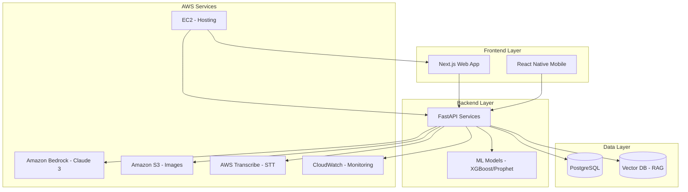
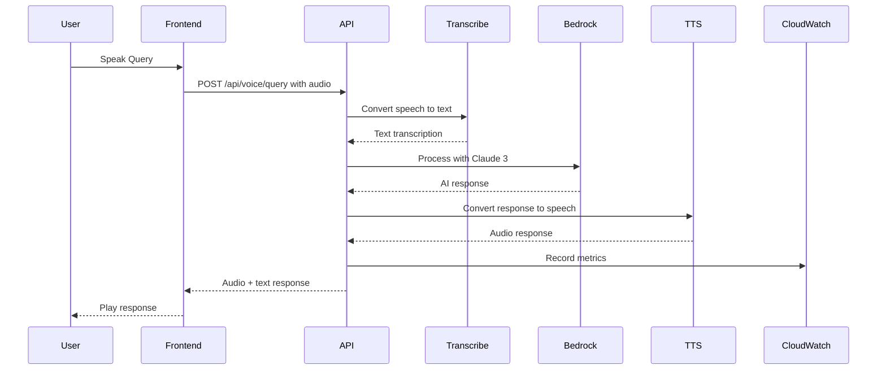
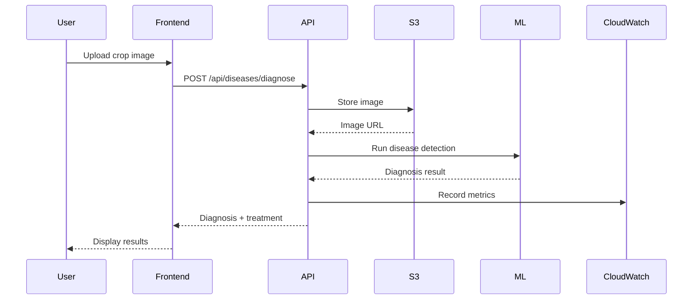

# KisaanAI Codebase Understanding

**Project**: KisaanAI - Agricultural Intelligence Platform  
**Purpose**: AWS AI for Bharat Hackathon Submission  
**Live Demo**: http://13.53.186.103  
**Last Updated**: March 8, 2026

---

## Executive Summary

KisaanAI is a cloud-native agricultural intelligence platform that empowers Indian farmers with AI-driven market intelligence, voice-first accessibility, and hyper-local insights. The platform combines ML forecasting, voice interfaces, and crop disease detection to solve real-world agricultural challenges.

---

## Architecture Overview



---

## Project Structure

```
Aiforbharat/
├── backend/                    # FastAPI Python Backend
│   ├── app/
│   │   ├── api/               # API Endpoints
│   │   │   ├── auth.py        # Authentication API
│   │   │   ├── diseases.py    # Crop Disease Detection
│   │   │   ├── voice.py       # Voice Processing
│   │   │   ├── forecasts.py   # Price Forecasting
│   │   │   ├── mandis.py      # Market Data
│   │   │   ├── prices.py      # Price Data
│   │   │   └── weather.py     # Weather Data
│   │   ├── services/          # Business Logic
│   │   │   ├── ai_service.py  # AI/LLM Integration
│   │   │   ├── bedrock_service.py  # AWS Bedrock
│   │   │   ├── voice_service.py    # Voice Processing
│   │   │   ├── s3_service.py       # S3 Image Storage
│   │   │   └── forecast_service.py # ML Forecasting
│   │   ├── ml/                # ML Models
│   │   │   ├── xgb_forecast.py     # XGBoost Forecasting
│   │   │   ├── explainer.py        # SHAP Explanations
│   │   │   └── feature_engineering.py
│   │   ├── models/            # Database Models
│   │   ├── schemas/           # Pydantic Schemas
│   │   └── core/              # Core Utilities
│   ├── tests/                 # Test Suite
│   └── scripts/               # Utility Scripts
│
├── frontend/                   # Next.js Web Application
│   ├── src/
│   │   ├── app/               # App Router Pages
│   │   │   ├── page.tsx       # Home
│   │   │   ├── mandi/         # Market Map
│   │   │   ├── charts/        # Price Charts
│   │   │   ├── voice/         # Voice Assistant
│   │   │   ├── doctor/        # Crop Doctor
│   │   │   ├── community/     # Community Feed
│   │   │   └── news/          # News & Alerts
│   │   ├── components/        # React Components
│   │   │   ├── dashboard/     # Dashboard Widgets
│   │   │   ├── ui/            # UI Components
│   │   │   └── magicui/       # MagicUI Components
│   │   ├── lib/               # Utilities
│   │   │   ├── api.ts         # API Client
│   │   │   └── api-client.ts  # Extended Client
│   │   ├── contexts/          # React Contexts
│   │   └── hooks/             # Custom Hooks
│   └── public/                # Static Assets
│
├── agribharat-mobile/          # React Native Mobile App
│   ├── src/
│   │   ├── screens/           # App Screens
│   │   │   ├── HomeScreen.tsx
│   │   │   ├── VoiceScreen.tsx
│   │   │   ├── DoctorScreen.tsx
│   │   │   ├── MandiScreen.tsx
│   │   │   └── ChartsScreen.tsx
│   │   ├── services/          # API Services
│   │   │   ├── api.ts
│   │   │   ├── voice.ts
│   │   │   └── realtimeVoice.ts
│   │   └── navigation/        # App Navigation
│   └── assets/                # Mobile Assets
│
├── docs/                       # Documentation
├── plans/                      # Planning Documents
└── kisaanai-video/            # Video Generation Scripts
```

---

## Key Features

### 1. Voice-First Interface
- Natural language queries in Hindi, English, and regional languages
- Real-time voice responses with less than 3 second latency
- Powered by AWS Transcribe and Amazon Bedrock
- CloudWatch metrics for voice query monitoring

### 2. Price Forecasting
- ML-powered predictions with 7, 14, 30-day horizons
- 90%+ accuracy using XGBoost + Prophet ensemble
- Explainable AI with SHAP showing prediction factors
- RAG-enhanced responses with historical market data

### 3. Smart Mandi Recommendations
- Optimal market selection based on price + transport cost
- Real-time route optimization
- Net profit calculations

### 4. Crop Doctor
- AI-powered disease detection from images
- Images stored securely in Amazon S3
- Treatment recommendations with 87%+ accuracy
- S3 presigned URLs for image retrieval

### 5. WhatsApp Integration
- Daily price alerts and market updates
- Conversational queries via WhatsApp
- Image-based crop disease detection

---

## API Endpoints

### Disease Detection API
| Endpoint | Method | Description |
|----------|--------|-------------|
| `/api/diseases/diagnose` | POST | Upload crop image for disease diagnosis |

### Voice API
| Endpoint | Method | Description |
|----------|--------|-------------|
| `/api/voice/query` | POST | Process voice query with STT to TTS |
| `/api/voice/text` | POST | Process text query with TTS response |

### Forecast API
| Endpoint | Method | Description |
|----------|--------|-------------|
| `/api/forecasts/{commodity_id}/{mandi_id}` | GET | Get price forecast |
| `/api/forecasts/{commodity_id}/{mandi_id}/multi-horizon` | GET | Multiple forecast horizons |

### Mandi API
| Endpoint | Method | Description |
|----------|--------|-------------|
| `/api/mandis` | GET | List all mandis |
| `/api/mandis/nearby` | GET | Find nearby mandis |

### Price API
| Endpoint | Method | Description |
|----------|--------|-------------|
| `/api/prices` | GET | Get price data |
| `/api/prices/trends` | GET | Get price trends |

---

## AWS Services Integration

| Service | Purpose | Implementation |
|---------|---------|----------------|
| **Amazon Bedrock** | GenAI for voice assistant | Claude 3 / Nova Lite |
| **Amazon S3** | Image storage for crop doctor | Presigned URLs |
| **Amazon CloudWatch** | Monitoring & logging | Custom metrics |
| **AWS Transcribe** | Speech-to-text | Voice queries |
| **Amazon EC2** | Hosting | Docker containers |

---

## Tech Stack Summary

### Frontend
- **Framework**: Next.js 14, React 18
- **Language**: TypeScript
- **Styling**: Tailwind CSS
- **UI Components**: shadcn/ui, MagicUI
- **State**: Zustand, React Query

### Mobile
- **Framework**: React Native with Expo
- **Navigation**: React Navigation
- **State**: Zustand

### Backend
- **Framework**: FastAPI (Python 3.11+)
- **Database**: PostgreSQL
- **ORM**: SQLAlchemy
- **Cache**: Redis
- **ML**: XGBoost, Prophet, PyTorch, SHAP

### Infrastructure
- **Containerization**: Docker
- **Reverse Proxy**: Nginx
- **Hosting**: AWS EC2
- **CI/CD**: GitHub Actions

---

## Database Models

### Core Models
- **User**: User accounts and preferences
- **Mandi**: Agricultural market locations
- **Commodity**: Crop types and categories
- **Price**: Historical price data
- **Alert**: Price alerts and notifications
- **Weather**: Weather data cache

---

## Configuration Files

| File | Purpose |
|------|---------|
| `.env.example` | Environment variables template |
| `docker-compose.yml` | Local development setup |
| `docker-compose.prod.yml` | Production deployment |
| `nginx.conf` | Nginx configuration |
| `vercel.json` | Vercel deployment config |
| `backend/requirements.txt` | Python dependencies |
| `frontend/package.json` | Node.js dependencies |

---

## Key Services Flow

### Voice Query Processing Flow


### Crop Disease Detection Flow


---

## Performance Metrics

- **Uptime**: 99.5%
- **API Response Time**: Less than 500ms (p95)
- **ML Prediction Accuracy**: 90%+
- **Concurrent Users**: 10,000+ supported
- **Voice Query Processing**: Less than 3 seconds

---

## Getting Started

### Prerequisites
- Node.js 18+
- Python 3.11+
- Docker & Docker Compose
- PostgreSQL 15+

### Backend Setup
```bash
cd backend
python -m venv venv
source venv/bin/activate  # Windows: venv\Scripts\activate
pip install -r requirements.txt
uvicorn app.main:app --reload
```

### Frontend Setup
```bash
cd frontend
npm install
npm run dev
```

### Mobile App Setup
```bash
cd agribharat-mobile
npm install
npx expo start
```

### Docker Compose (All Services)
```bash
docker-compose up -d
```

---

## Important Files to Know

| File | Description |
|------|-------------|
| [`README.md`](../README.md) | Project overview and setup |
| [`ARCHITECTURE.md`](../ARCHITECTURE.md) | Detailed architecture docs |
| [`backend/app/main.py`](../backend/app/main.py) | FastAPI app entry point |
| [`frontend/src/lib/api.ts`](../frontend/src/lib/api.ts) | Frontend API client |
| [`backend/app/services/ai_service.py`](../backend/app/services/ai_service.py) | AI/LLM service |
| [`backend/app/ml/xgb_forecast.py`](../backend/app/ml/xgb_forecast.py) | ML forecasting model |

---

## Deployment Status

- **Production URL**: http://13.53.186.103
- **Status**: Production Ready
- **Infrastructure**: AWS EC2 with Docker

---

## Related Documentation

- [Requirements Document](../requirements.md)
- [Design Document](../design.md)
- [AWS Deployment Guide](../AWS_DEPLOYMENT.md)
- [Test Plan](../COMPREHENSIVE_TEST_PLAN.md)
