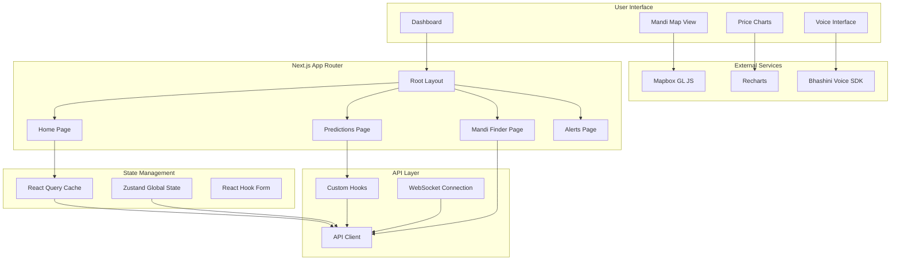
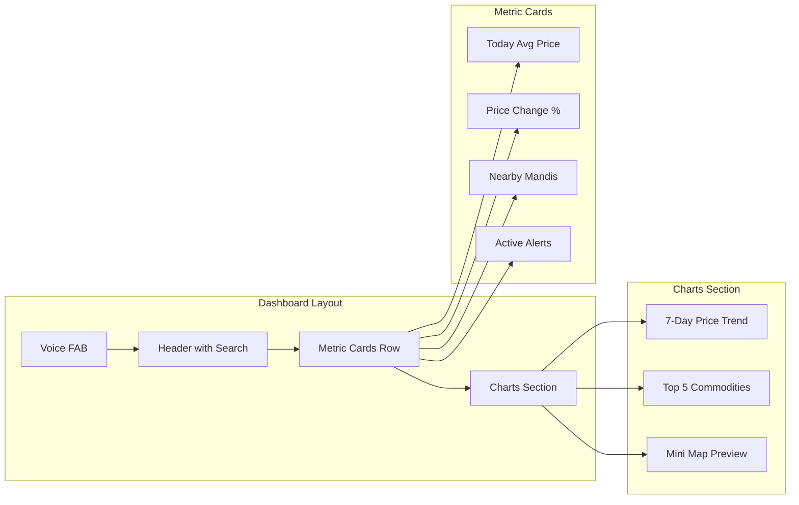

# Frontend Implementation Plan: Agri-Analytics Platform

## Executive Summary

This document outlines the comprehensive implementation plan for the frontend of the Agricultural Analytics Platform. The frontend is designed as a **mobile-first, voice-accessible** web application that empowers Indian farmers with price forecasts, mandi recommendations, and intuitive voice interactions.

---

## 1. System Architecture Overview

### 1.1 High-Level Frontend Architecture



### 1.2 Technology Stack Summary

| Layer | Technology | Purpose |
|-------|------------|---------|
| Framework | Next.js 14 | App Router, SSR, API routes |
| Language | TypeScript | Type safety |
| Styling | Tailwind CSS | Utility-first styling |
| Components | ShadCN/UI | Accessible component library |
| State | React Query + Zustand | Server + client state |
| Maps | Mapbox GL JS | Interactive geospatial |
| Charts | Recharts | Data visualization |
| Forms | React Hook Form | Form handling |
| Voice | Bhashini API + Web Speech | Voice interface |
| i18n | next-intl | Internationalization |

---

## 2. Project Structure

```
frontend/
├── app/
│   ├── [locale]/
│   │   ├── layout.tsx           # Root layout with providers
│   │   ├── page.tsx             # Home/Dashboard page
│   │   ├── predictions/
│   │   │   ├── page.tsx         # Price predictions
│   │   │   └── [commodity]/
│   │   │       └── page.tsx     # Commodity-specific predictions
│   │   ├── mandi/
│   │   │   ├── page.tsx         # Mandi finder with map
│   │   │   └── [id]/
│   │   │       └── page.tsx     # Mandi details
│   │   ├── alerts/
│   │   │   └── page.tsx         # Price alerts management
│   │   └── settings/
│   │       └── page.tsx         # User preferences
│   ├── api/
│   │   ├── voice/
│   │   │   └── route.ts         # Voice processing API route
│   │   └── auth/
│   │       └── route.ts         # Auth callback
│   ├── globals.css
│   └── layout.tsx               # Root layout
│
├── components/
│   ├── ui/                      # ShadCN components
│   │   ├── button.tsx
│   │   ├── card.tsx
│   │   ├── input.tsx
│   │   ├── select.tsx
│   │   ├── dialog.tsx
│   │   ├── toast.tsx
│   │   └── ...
│   │
│   ├── layout/
│   │   ├── Header.tsx
│   │   ├── Sidebar.tsx
│   │   ├── BottomNav.tsx        # Mobile bottom navigation
│   │   └── Footer.tsx
│   │
│   ├── dashboard/
│   │   ├── MetricCard.tsx
│   │   ├── TrendChart.tsx
│   │   ├── TopCommodities.tsx
│   │   └── RecentAlerts.tsx
│   │
│   ├── predictions/
│   │   ├── PriceForecastChart.tsx
│   │   ├── ConfidenceInterval.tsx
│   │   ├── ExplanationPanel.tsx  # SHAP explanations
│   │   └── CommoditySelector.tsx
│   │
│   ├── mandi/
│   │   ├── MandiMap.tsx          # Mapbox map component
│   │   ├── MandiCard.tsx
│   │   ├── MandiList.tsx
│   │   ├── OptimalRoute.tsx      # Route optimization display
│   │   └── MandiComparison.tsx
│   │
│   ├── voice/
│   │   ├── VoiceButton.tsx       # Mic button component
│   │   ├── VoiceModal.tsx        # Voice interaction modal
│   │   ├── TranscriptDisplay.tsx
│   │   └── AudioPlayer.tsx
│   │
│   └── common/
│       ├── LoadingSpinner.tsx
│       ├── ErrorBoundary.tsx
│       ├── EmptyState.tsx
│       ├── LanguageSwitcher.tsx
│       └── ThemeToggle.tsx
│
├── hooks/
│   ├── useForecast.ts            # React Query hook for forecasts
│   ├── useMandis.ts              # Mandi data hook
│   ├── useCommodities.ts         # Commodities hook
│   ├── useVoice.ts               # Voice interaction hook
│   ├── useGeolocation.ts         # Browser geolocation
│   └── useLocalStorage.ts        # Persistent storage
│
├── lib/
│   ├── api/
│   │   ├── client.ts             # Axios/fetch wrapper
│   │   ├── forecasts.ts          # Forecast API calls
│   │   ├── mandis.ts             # Mandi API calls
│   │   └── voice.ts              # Voice API calls
│   │
│   ├── voice/
│   │   ├── bhashini.ts           # Bhashini SDK wrapper
│   │   ├── speechRecognition.ts  # Web Speech API
│   │   └── audioUtils.ts         # Audio processing
│   │
│   ├── maps/
│   │   ├── mapbox.ts             # Mapbox configuration
│   │   └── geoUtils.ts           # Geospatial utilities
│   │
│   └── utils/
│       ├── formatting.ts         # Number/date formatting
│       ├── validation.ts         # Input validation
│       └── constants.ts          # App constants
│
├── store/
│   ├── useAppStore.ts            # Zustand global store
│   ├── useAuthStore.ts           # Auth state
│   └── usePreferencesStore.ts    # User preferences
│
├── types/
│   ├── api.ts                    # API response types
│   ├── commodity.ts
│   ├── mandi.ts
│   ├── forecast.ts
│   └── voice.ts
│
├── i18n/
│   ├── config.ts
│   ├── en.json                   # English translations
│   └── hi.json                   # Hindi translations
│
├── public/
│   ├── icons/
│   ├── images/
│   └── sounds/
│       ├── listen.mp3            # Voice prompt sounds
│       └── success.mp3
│
├── next.config.js
├── tailwind.config.ts
├── tsconfig.json
├── package.json
└── README.md
```

---

## 3. Core Components Implementation

### 3.1 Dashboard Page



#### Dashboard Page Implementation

```tsx
// app/[locale]/page.tsx
import { MetricCard } from '@/components/dashboard/MetricCard';
import { TrendChart } from '@/components/dashboard/TrendChart';
import { TopCommodities } from '@/components/dashboard/TopCommodities';
import { VoiceButton } from '@/components/voice/VoiceButton';
import { useForecast } from '@/hooks/useForecast';
import { useCommodities } from '@/hooks/useCommodities';

export default function DashboardPage() {
  const { data: forecastData, isLoading } = useForecast({
    commodityId: 1, // Default commodity
    days: 7
  });
  
  const { data: commodities } = useCommodities();

  return (
    <main className="min-h-screen pb-20 md:pb-0">
      {/* Header */}
      <header className="bg-gradient-to-r from-green-600 to-green-700 text-white p-4 md:p-6">
        <h1 className="text-2xl md:text-3xl font-bold">
          KrishiMitra
        </h1>
        <p className="text-green-100 mt-1">
          Your Agricultural Price Assistant
        </p>
      </header>

      {/* Metric Cards */}
      <section className="grid grid-cols-2 md:grid-cols-4 gap-4 p-4 md:p-6">
        <MetricCard
          title="Avg Price Today"
          value={`₹${forecastData?.currentPrice || '---'}`}
          trend={forecastData?.trend}
          icon="indian-rupee"
        />
        <MetricCard
          title="Change"
          value={`${forecastData?.changePercent || 0}%`}
          trend={forecastData?.changePercent > 0 ? 'up' : 'down'}
          icon="trending-up"
        />
        <MetricCard
          title="Nearby Mandis"
          value="12"
          icon="map-pin"
        />
        <MetricCard
          title="Active Alerts"
          value="3"
          icon="bell"
        />
      </section>

      {/* Charts Section */}
      <section className="px-4 md:px-6 space-y-6">
        <TrendChart data={forecastData?.predictions || []} />
        <TopCommodities commodities={commodities?.slice(0, 5) || []} />
      </section>

      {/* Voice FAB */}
      <VoiceButton className="fixed bottom-24 right-4 md:bottom-8" />
    </main>
  );
}
```

### 3.2 Price Forecast Chart Component

```tsx
// components/predictions/PriceForecastChart.tsx
'use client';

import {
  LineChart,
  Line,
  XAxis,
  YAxis,
  CartesianGrid,
  Tooltip,
  Legend,
  ResponsiveContainer,
  Area,
  ComposedChart
} from 'recharts';
import { Card, CardContent, CardHeader, CardTitle } from '@/components/ui/card';

interface ForecastDataPoint {
  date: string;
  actual?: number;
  predicted: number;
  lowerBound: number;
  upperBound: number;
}

interface PriceForecastChartProps {
  data: ForecastDataPoint[];
  commodityName?: string;
}

export function PriceForecastChart({ data, commodityName }: PriceForecastChartProps) {
  return (
    <Card>
      <CardHeader>
        <CardTitle className="flex items-center gap-2">
          <span>Price Forecast</span>
          {commodityName && (
            <span className="text-sm font-normal text-muted-foreground">
              - {commodityName}
            </span>
          )}
        </CardTitle>
      </CardHeader>
      <CardContent>
        <ResponsiveContainer width="100%" height={300}>
          <ComposedChart data={data}>
            <CartesianGrid strokeDasharray="3 3" />
            <XAxis 
              dataKey="date" 
              tickFormatter={(value) => new Date(value).toLocaleDateString('en-IN', { day: 'numeric', month: 'short' })}
            />
            <YAxis 
              tickFormatter={(value) => `₹${value}`}
              domain={['auto', 'auto']}
            />
            <Tooltip 
              formatter={(value: number) => [`₹${value.toFixed(2)}`, '']}
              labelFormatter={(label) => new Date(label).toLocaleDateString('en-IN', { weekday: 'long', day: 'numeric', month: 'long' })}
            />
            <Legend />
            
            {/* Confidence Interval Area */}
            <Area
              type="monotone"
              dataKey="upperBound"
              stackId="1"
              stroke="transparent"
              fill="#22c55e"
              fillOpacity={0.1}
              name="Upper Bound"
            />
            <Area
              type="monotone"
              dataKey="lowerBound"
              stackId="2"
              stroke="transparent"
              fill="#22c55e"
              fillOpacity={0.1}
              name="Lower Bound"
            />
            
            {/* Actual Price Line */}
            <Line
              type="monotone"
              dataKey="actual"
              stroke="#6b7280"
              strokeWidth={2}
              dot={{ fill: '#6b7280' }}
              name="Actual Price"
              connectNulls={false}
            />
            
            {/* Predicted Price Line */}
            <Line
              type="monotone"
              dataKey="predicted"
              stroke="#22c55e"
              strokeWidth={2}
              strokeDasharray="5 5"
              dot={{ fill: '#22c55e' }}
              name="Predicted Price"
            />
          </ComposedChart>
        </ResponsiveContainer>
      </CardContent>
    </Card>
  );
}
```

### 3.3 Mandi Map Component

```tsx
// components/mandi/MandiMap.tsx
'use client';

import { useEffect, useRef, useState } from 'react';
import mapboxgl from 'mapbox-gl';
import 'mapbox-gl/dist/mapbox-gl.css';
import { Card } from '@/components/ui/card';
import { Button } from '@/components/ui/button';
import { useGeolocation } from '@/hooks/useGeolocation';
import { Mandi } from '@/types/mandi';

mapboxgl.accessToken = process.env.NEXT_PUBLIC_MAPBOX_TOKEN!;

interface MandiMapProps {
  mandis: Mandi[];
  onMandiSelect: (mandi: Mandi) => void;
  selectedCommodity?: string;
}

export function MandiMap({ mandis, onMandiSelect, selectedCommodity }: MandiMapProps) {
  const mapContainer = useRef<HTMLDivElement>(null);
  const map = useRef<mapboxgl.Map | null>(null);
  const markers = useRef<mapboxgl.Marker[]>([]);
  const { location: userLocation } = useGeolocation();
  const [selectedMandi, setSelectedMandi] = useState<Mandi | null>(null);

  useEffect(() => {
    if (!mapContainer.current || map.current) return;

    map.current = new mapboxgl.Map({
      container: mapContainer.current,
      style: 'mapbox://styles/mapbox/streets-v12',
      center: [78.9629, 20.5937], // Center of India
      zoom: 5
    });

    map.current.addControl(new mapboxgl.NavigationControl(), 'top-right');

    return () => {
      map.current?.remove();
    };
  }, []);

  useEffect(() => {
    if (!map.current || !userLocation) return;

    // Add user location marker
    new mapboxgl.Marker({ color: '#3b82f6' })
      .setLngLat([userLocation.longitude, userLocation.latitude])
      .addTo(map.current);

    map.current.flyTo({
      center: [userLocation.longitude, userLocation.latitude],
      zoom: 8
    });
  }, [userLocation]);

  useEffect(() => {
    if (!map.current || !mandis.length) return;

    // Clear existing markers
    markers.current.forEach(marker => marker.remove());
    markers.current = [];

    // Add mandi markers
    mandis.forEach(mandi => {
      const el = document.createElement('div');
      el.className = 'mandi-marker';
      el.innerHTML = `
        <div class="w-8 h-8 bg-green-500 rounded-full flex items-center justify-center text-white text-xs font-bold shadow-lg cursor-pointer hover:bg-green-600 transition-colors">
          ${mandi.name.charAt(0)}
        </div>
      `;

      const marker = new mapboxgl.Marker(el)
        .setLngLat([mandi.longitude, mandi.latitude])
        .setPopup(
          new mapboxgl.Popup({ offset: 25 })
            .setHTML(`
              <div class="p-2">
                <h3 class="font-bold">${mandi.name}</h3>
                <p class="text-sm text-gray-600">${mandi.district}, ${mandi.state}</p>
                ${selectedCommodity ? `<p class="text-green-600 font-semibold mt-1">₹${mandi.currentPrice || '---'}/Quintal</p>` : ''}
              </div>
            `)
        )
        .addTo(map.current!);

      marker.getElement().addEventListener('click', () => {
        setSelectedMandi(mandi);
        onMandiSelect(mandi);
      });

      markers.current.push(marker);
    });
  }, [mandis, selectedCommodity, onMandiSelect]);

  return (
    <div className="relative h-[400px] md:h-[500px] rounded-lg overflow-hidden">
      <div ref={mapContainer} className="h-full w-full" />
      
      {/* Legend */}
      <Card className="absolute bottom-4 left-4 p-3 bg-white/90 backdrop-blur">
        <div className="flex items-center gap-4 text-sm">
          <div className="flex items-center gap-2">
            <div className="w-4 h-4 bg-blue-500 rounded-full" />
            <span>Your Location</span>
          </div>
          <div className="flex items-center gap-2">
            <div className="w-4 h-4 bg-green-500 rounded-full" />
            <span>Mandi</span>
          </div>
        </div>
      </Card>

      {/* Selected Mandi Info */}
      {selectedMandi && (
        <Card className="absolute top-4 right-4 p-4 bg-white/90 backdrop-blur max-w-xs">
          <h3 className="font-bold text-lg">{selectedMandi.name}</h3>
          <p className="text-sm text-muted-foreground">
            {selectedMandi.district}, {selectedMandi.state}
          </p>
          {selectedMandi.currentPrice && (
            <p className="text-green-600 font-semibold mt-2">
              ₹{selectedMandi.currentPrice}/Quintal
            </p>
          )}
          <Button 
            className="mt-3 w-full" 
            size="sm"
            onClick={() => {/* Navigate to mandi details */}}
          >
            View Details
          </Button>
        </Card>
      )}
    </div>
  );
}
```

### 3.4 Voice Interface Components

```tsx
// components/voice/VoiceButton.tsx
'use client';

import { useState } from 'react';
import { Button } from '@/components/ui/button';
import { VoiceModal } from './VoiceModal';
import { Mic } from 'lucide-react';

interface VoiceButtonProps {
  className?: string;
}

export function VoiceButton({ className }: VoiceButtonProps) {
  const [isModalOpen, setIsModalOpen] = useState(false);

  return (
    <>
      <Button
        size="lg"
        className={`h-14 w-14 rounded-full shadow-lg bg-green-600 hover:bg-green-700 ${className}`}
        onClick={() => setIsModalOpen(true)}
      >
        <Mic className="h-6 w-6" />
      </Button>

      <VoiceModal 
        isOpen={isModalOpen} 
        onClose={() => setIsModalOpen(false)} 
      />
    </>
  );
}
```

```tsx
// components/voice/VoiceModal.tsx
'use client';

import { useState, useEffect, useRef } from 'react';
import {
  Dialog,
  DialogContent,
  DialogHeader,
  DialogTitle,
} from '@/components/ui/dialog';
import { Button } from '@/components/ui/button';
import { Mic, MicOff, Volume2, Loader2 } from 'lucide-react';
import { useVoice } from '@/hooks/useVoice';
import { TranscriptDisplay } from './TranscriptDisplay';

interface VoiceModalProps {
  isOpen: boolean;
  onClose: () => void;
}

type VoiceState = 'idle' | 'listening' | 'processing' | 'speaking';

export function VoiceModal({ isOpen, onClose }: VoiceModalProps) {
  const [state, setState] = useState<VoiceState>('idle');
  const [transcript, setTranscript] = useState('');
  const [response, setResponse] = useState('');
  const audioRef = useRef<HTMLAudioElement>(null);
  
  const { startListening, stopListening, isSupported } = useVoice({
    onResult: handleVoiceResult,
    onEnd: handleVoiceEnd,
    language: 'hi-IN' // Default to Hindi
  });

  function handleVoiceResult(text: string) {
    setTranscript(text);
  }

  function handleVoiceEnd() {
    setState('processing');
    processQuery(transcript);
  }

  async function processQuery(query: string) {
    try {
      // Send to backend for processing
      const res = await fetch('/api/voice', {
        method: 'POST',
        headers: { 'Content-Type': 'application/json' },
        body: JSON.stringify({ query, language: 'hi' })
      });

      const data = await res.json();
      setResponse(data.text);
      
      // Play audio response
      if (data.audioUrl) {
        setState('speaking');
        if (audioRef.current) {
          audioRef.current.src = data.audioUrl;
          audioRef.current.play();
        }
      }
    } catch (error) {
      setResponse('Sorry, I could not process your request. Please try again.');
    } finally {
      setState('idle');
    }
  }

  const handleMicClick = () => {
    if (state === 'idle') {
      setState('listening');
      startListening();
    } else if (state === 'listening') {
      setState('idle');
      stopListening();
    }
  };

  const getStateMessage = () => {
    switch (state) {
      case 'listening':
        return 'Listening... Speak now';
      case 'processing':
        return 'Processing your query...';
      case 'speaking':
        return 'Playing response...';
      default:
        return 'Tap the microphone to speak';
    }
  };

  const getStateColor = () => {
    switch (state) {
      case 'listening':
        return 'bg-red-500 animate-pulse';
      case 'processing':
        return 'bg-yellow-500';
      case 'speaking':
        return 'bg-blue-500';
      default:
        return 'bg-green-600';
    }
  };

  return (
    <Dialog open={isOpen} onOpenChange={onClose}>
      <DialogContent className="sm:max-w-md">
        <DialogHeader>
          <DialogTitle className="text-center">
            Voice Assistant
          </DialogTitle>
        </DialogHeader>

        <div className="flex flex-col items-center space-y-6 py-6">
          {/* State Message */}
          <p className="text-muted-foreground text-center">
            {getStateMessage()}
          </p>

          {/* Mic Button */}
          <Button
            size="lg"
            className={`h-20 w-20 rounded-full shadow-xl ${getStateColor()}`}
            onClick={handleMicClick}
            disabled={state === 'processing' || state === 'speaking'}
          >
            {state === 'processing' ? (
              <Loader2 className="h-8 w-8 animate-spin" />
            ) : state === 'listening' ? (
              <MicOff className="h-8 w-8" />
            ) : (
              <Mic className="h-8 w-8" />
            )}
          </Button>

          {/* Transcript Display */}
          {transcript && (
            <TranscriptDisplay 
              original={transcript}
              translation={response}
            />
          )}

          {/* Quick Prompts */}
          <div className="flex flex-wrap gap-2 justify-center">
            {['Aaj aaloo ka bhaav', 'Nearby mandis', 'Tomato price'].map((prompt) => (
              <Button
                key={prompt}
                variant="outline"
                size="sm"
                onClick={() => {
                  setTranscript(prompt);
                  processQuery(prompt);
                }}
              >
                {prompt}
              </Button>
            ))}
          </div>
        </div>

        <audio ref={audioRef} onEnded={() => setState('idle')} />
      </DialogContent>
    </Dialog>
  );
}
```

### 3.5 SHAP Explanation Panel

```tsx
// components/predictions/ExplanationPanel.tsx
'use client';

import { Card, CardContent, CardHeader, CardTitle } from '@/components/ui/card';
import {
  BarChart,
  Bar,
  XAxis,
  YAxis,
  CartesianGrid,
  Tooltip,
  ResponsiveContainer,
  Cell
} from 'recharts';
import { Lightbulb, TrendingUp, TrendingDown } from 'lucide-react';

interface ExplanationFactor {
  feature: string;
  impact: number;
  description: string;
}

interface ExplanationPanelProps {
  factors: ExplanationFactor[];
  naturalLanguage: string;
  language?: 'en' | 'hi';
}

export function ExplanationPanel({ 
  factors, 
  naturalLanguage,
  language = 'en' 
}: ExplanationPanelProps) {
  const chartData = factors.map(f => ({
    name: f.feature,
    value: f.impact,
    description: f.description
  }));

  const getBarColor = (value: number) => {
    return value > 0 ? '#22c55e' : '#ef4444';
  };

  return (
    <Card>
      <CardHeader>
        <CardTitle className="flex items-center gap-2">
          <Lightbulb className="h-5 w-5 text-yellow-500" />
          {language === 'en' ? 'Why this price?' : 'यह कीमत क्यों?'}
        </CardTitle>
      </CardHeader>
      <CardContent className="space-y-4">
        {/* Natural Language Explanation */}
        <div className="p-4 bg-muted rounded-lg">
          <p className="text-sm leading-relaxed">
            {naturalLanguage}
          </p>
        </div>

        {/* Feature Impact Chart */}
        <div className="h-[200px]">
          <ResponsiveContainer width="100%" height="100%">
            <BarChart
              data={chartData}
              layout="vertical"
              margin={{ left: 80 }}
            >
              <CartesianGrid strokeDasharray="3 3" />
              <XAxis 
                type="number"
                tickFormatter={(v) => `${v > 0 ? '+' : ''}${(v * 100).toFixed(0)}%`}
              />
              <YAxis 
                type="category" 
                dataKey="name"
                width={75}
              />
              <Tooltip 
                formatter={(value: number) => [`${(value * 100).toFixed(1)}% impact`, 'Price Impact']}
              />
              <Bar dataKey="value" radius={[0, 4, 4, 0]}>
                {chartData.map((entry, index) => (
                  <Cell key={`cell-${index}`} fill={getBarColor(entry.value)} />
                ))}
              </Bar>
            </BarChart>
          </ResponsiveContainer>
        </div>

        {/* Factor Cards */}
        <div className="grid gap-2">
          {factors.slice(0, 3).map((factor, index) => (
            <div 
              key={index}
              className="flex items-center gap-3 p-3 bg-muted/50 rounded-lg"
            >
              {factor.impact > 0 ? (
                <TrendingUp className="h-4 w-4 text-green-500" />
              ) : (
                <TrendingDown className="h-4 w-4 text-red-500" />
              )}
              <div className="flex-1">
                <p className="text-sm font-medium">{factor.feature}</p>
                <p className="text-xs text-muted-foreground">{factor.description}</p>
              </div>
              <span className={`text-sm font-semibold ${
                factor.impact > 0 ? 'text-green-600' : 'text-red-600'
              }`}>
                {factor.impact > 0 ? '+' : ''}{(factor.impact * 100).toFixed(0)}%
              </span>
            </div>
          ))}
        </div>
      </CardContent>
    </Card>
  );
}
```

---

## 4. Custom Hooks Implementation

### 4.1 useForecast Hook

```tsx
// hooks/useForecast.ts
import { useQuery } from '@tanstack/react-query';
import { api } from '@/lib/api/client';
import { ForecastResponse } from '@/types/forecast';

interface UseForecastOptions {
  commodityId: number;
  mandiId?: number;
  days?: number;
  enabled?: boolean;
}

export function useForecast({
  commodityId,
  mandiId,
  days = 7,
  enabled = true
}: UseForecastOptions) {
  return useQuery({
    queryKey: ['forecast', commodityId, mandiId, days],
    queryFn: async () => {
      const params = new URLSearchParams({
        commodity_id: commodityId.toString(),
        days: days.toString(),
        ...(mandiId && { mandi_id: mandiId.toString() })
      });
      
      const response = await api.get<ForecastResponse>(
        `/api/v1/forecasts/predict?${params}`
      );
      return response.data;
    },
    enabled: enabled && !!commodityId,
    staleTime: 5 * 60 * 1000, // 5 minutes
    gcTime: 30 * 60 * 1000 // 30 minutes
  });
}
```

### 4.2 useVoice Hook

```tsx
// hooks/useVoice.ts
'use client';

import { useState, useCallback, useRef } from 'react';

interface UseVoiceOptions {
  onResult: (transcript: string) => void;
  onEnd?: () => void;
  language?: string;
}

export function useVoice({ onResult, onEnd, language = 'hi-IN' }: UseVoiceOptions) {
  const [isListening, setIsListening] = useState(false);
  const recognitionRef = useRef<SpeechRecognition | null>(null);

  const isSupported = typeof window !== 'undefined' && 
    ('SpeechRecognition' in window || 'webkitSpeechRecognition' in window);

  const startListening = useCallback(() => {
    if (!isSupported) {
      console.error('Speech recognition not supported');
      return;
    }

    const SpeechRecognition = window.SpeechRecognition || window.webkitSpeechRecognition;
    recognitionRef.current = new SpeechRecognition();
    
    recognitionRef.current.continuous = false;
    recognitionRef.current.interimResults = true;
    recognitionRef.current.lang = language;

    recognitionRef.current.onresult = (event) => {
      const transcript = Array.from(event.results)
        .map(result => result[0].transcript)
        .join('');
      
      onResult(transcript);
    };

    recognitionRef.current.onend = () => {
      setIsListening(false);
      onEnd?.();
    };

    recognitionRef.current.onerror = (event) => {
      console.error('Speech recognition error:', event.error);
      setIsListening(false);
    };

    recognitionRef.current.start();
    setIsListening(true);
  }, [isSupported, language, onResult, onEnd]);

  const stopListening = useCallback(() => {
    if (recognitionRef.current) {
      recognitionRef.current.stop();
      setIsListening(false);
    }
  }, []);

  return {
    isListening,
    isSupported,
    startListening,
    stopListening
  };
}
```

### 4.3 useGeolocation Hook

```tsx
// hooks/useGeolocation.ts
'use client';

import { useState, useEffect } from 'react';

interface GeolocationState {
  location: {
    latitude: number;
    longitude: number;
  } | null;
  error: string | null;
  loading: boolean;
}

export function useGeolocation() {
  const [state, setState] = useState<GeolocationState>({
    location: null,
    error: null,
    loading: true
  });

  useEffect(() => {
    if (!navigator.geolocation) {
      setState(prev => ({
        ...prev,
        error: 'Geolocation is not supported',
        loading: false
      }));
      return;
    }

    navigator.geolocation.getCurrentPosition(
      (position) => {
        setState({
          location: {
            latitude: position.coords.latitude,
            longitude: position.coords.longitude
          },
          error: null,
          loading: false
        });
      },
      (error) => {
        setState(prev => ({
          ...prev,
          error: error.message,
          loading: false
        }));
      },
      {
        enableHighAccuracy: true,
        timeout: 10000,
        maximumAge: 300000 // 5 minutes cache
      }
    );
  }, []);

  return state;
}
```

---

## 5. State Management

### 5.1 Zustand Store

```tsx
// store/useAppStore.ts
import { create } from 'zustand';
import { persist } from 'zustand/middleware';

interface AppState {
  // User preferences
  language: 'en' | 'hi';
  theme: 'light' | 'dark' | 'system';
  
  // Selected items
  selectedCommodity: number | null;
  selectedMandi: number | null;
  
  // UI state
  isVoiceModalOpen: boolean;
  
  // Actions
  setLanguage: (lang: 'en' | 'hi') => void;
  setTheme: (theme: 'light' | 'dark' | 'system') => void;
  setSelectedCommodity: (id: number | null) => void;
  setSelectedMandi: (id: number | null) => void;
  toggleVoiceModal: () => void;
}

export const useAppStore = create<AppState>()(
  persist(
    (set) => ({
      // Initial state
      language: 'hi',
      theme: 'light',
      selectedCommodity: null,
      selectedMandi: null,
      isVoiceModalOpen: false,

      // Actions
      setLanguage: (language) => set({ language }),
      setTheme: (theme) => set({ theme }),
      setSelectedCommodity: (selectedCommodity) => set({ selectedCommodity }),
      setSelectedMandi: (selectedMandi) => set({ selectedMandi }),
      toggleVoiceModal: () => set((state) => ({ 
        isVoiceModalOpen: !state.isVoiceModalOpen 
      }))
    }),
    {
      name: 'agri-analytics-storage',
      partialize: (state) => ({
        language: state.language,
        theme: state.theme
      })
    }
  )
);
```

---

## 6. Internationalization (i18n)

### 6.1 Translation Files

```json
// i18n/en.json
{
  "common": {
    "loading": "Loading...",
    "error": "Something went wrong",
    "retry": "Retry",
    "close": "Close"
  },
  "dashboard": {
    "title": "KrishiMitra - Agricultural Analytics",
    "todayPrice": "Today's Avg Price",
    "change": "Change",
    "nearbyMandis": "Nearby Mandis",
    "activeAlerts": "Active Alerts"
  },
  "predictions": {
    "title": "Price Predictions",
    "selectCommodity": "Select Commodity",
    "selectMandi": "Select Mandi",
    "forecastDays": "Forecast Days",
    "whyThisPrice": "Why this price?"
  },
  "voice": {
    "tapToSpeak": "Tap the microphone to speak",
    "listening": "Listening... Speak now",
    "processing": "Processing your query...",
    "notSupported": "Voice input is not supported in your browser"
  },
  "mandi": {
    "title": "Find Mandis",
    "optimalMandi": "Best Mandi for You",
    "distance": "Distance",
    "transportCost": "Transport Cost",
    "netProfit": "Net Profit"
  }
}
```

```json
// i18n/hi.json
{
  "common": {
    "loading": "लोड हो रहा है...",
    "error": "कुछ गलत हो गया",
    "retry": "पुनः प्रयास करें",
    "close": "बंद करें"
  },
  "dashboard": {
    "title": "कृषिमित्र - कृषि विश्लेषण",
    "todayPrice": "आज का औसत भाव",
    "change": "बदलाव",
    "nearbyMandis": "पास के मंडियां",
    "activeAlerts": "सक्रिय अलर्ट"
  },
  "predictions": {
    "title": "कीमत की भविष्यवाणी",
    "selectCommodity": "फसल चुनें",
    "selectMandi": "मंडी चुनें",
    "forecastDays": "भविष्यवाणी दिन",
    "whyThisPrice": "यह कीमत क्यों?"
  },
  "voice": {
    "tapToSpeak": "बोलने के लिए माइक दबाएं",
    "listening": "सुन रहा हूं... अब बोलें",
    "processing": "आपकी बात समझ रहा हूं...",
    "notSupported": "आपके ब्राउज़र में वॉइस इनपुट समर्थित नहीं है"
  },
  "mandi": {
    "title": "मंडी खोजें",
    "optimalMandi": "आपके लिए सबसे अच्छी मंडी",
    "distance": "दूरी",
    "transportCost": "परिवहन लागत",
    "netProfit": "शुद्ध लाभ"
  }
}
```

---

## 7. Mobile-First Design

### 7.1 Bottom Navigation Component

```tsx
// components/layout/BottomNav.tsx
'use client';

import Link from 'next/link';
import { usePathname } from 'next/navigation';
import { Home, MapPin, TrendingUp, Bell, Settings } from 'lucide-react';
import { cn } from '@/lib/utils';

const navItems = [
  { href: '/', icon: Home, label: 'Home' },
  { href: '/mandi', icon: MapPin, label: 'Mandis' },
  { href: '/predictions', icon: TrendingUp, label: 'Prices' },
  { href: '/alerts', icon: Bell, label: 'Alerts' },
  { href: '/settings', icon: Settings, label: 'Settings' }
];

export function BottomNav() {
  const pathname = usePathname();

  return (
    <nav className="fixed bottom-0 left-0 right-0 bg-white border-t md:hidden z-50">
      <div className="flex justify-around items-center h-16">
        {navItems.map((item) => {
          const isActive = pathname === item.href;
          const Icon = item.icon;
          
          return (
            <Link
              key={item.href}
              href={item.href}
              className={cn(
                'flex flex-col items-center justify-center flex-1 h-full',
                isActive ? 'text-green-600' : 'text-gray-500'
              )}
            >
              <Icon className="h-5 w-5" />
              <span className="text-xs mt-1">{item.label}</span>
            </Link>
          );
        })}
      </div>
    </nav>
  );
}
```

### 7.2 Responsive Layout

```tsx
// app/[locale]/layout.tsx
import { Header } from '@/components/layout/Header';
import { BottomNav } from '@/components/layout/BottomNav';
import { Sidebar } from '@/components/layout/Sidebar';
import { Providers } from './providers';

export default function LocaleLayout({
  children,
  params: { locale }
}: {
  children: React.ReactNode;
  params: { locale: string };
}) {
  return (
    <div className="min-h-screen bg-gray-50">
      <Providers>
        {/* Desktop Sidebar */}
        <aside className="hidden md:flex md:w-64 md:flex-col md:fixed md:inset-y-0">
          <Sidebar />
        </aside>

        {/* Main Content */}
        <div className="md:pl-64">
          <Header />
          <main className="pb-20 md:pb-0">
            {children}
          </main>
        </div>

        {/* Mobile Bottom Navigation */}
        <BottomNav />
      </Providers>
    </div>
  );
}
```

---

## 8. PWA Configuration

### 8.1 Manifest File

```json
// public/manifest.json
{
  "name": "KrishiMitra - Agricultural Analytics",
  "short_name": "KrishiMitra",
  "description": "AI-powered agricultural price forecasting and mandi finder for Indian farmers",
  "start_url": "/",
  "display": "standalone",
  "background_color": "#ffffff",
  "theme_color": "#16a34a",
  "orientation": "portrait-primary",
  "icons": [
    {
      "src": "/icons/icon-72x72.png",
      "sizes": "72x72",
      "type": "image/png"
    },
    {
      "src": "/icons/icon-96x96.png",
      "sizes": "96x96",
      "type": "image/png"
    },
    {
      "src": "/icons/icon-128x128.png",
      "sizes": "128x128",
      "type": "image/png"
    },
    {
      "src": "/icons/icon-144x144.png",
      "sizes": "144x144",
      "type": "image/png"
    },
    {
      "src": "/icons/icon-152x152.png",
      "sizes": "152x152",
      "type": "image/png"
    },
    {
      "src": "/icons/icon-192x192.png",
      "sizes": "192x192",
      "type": "image/png"
    },
    {
      "src": "/icons/icon-384x384.png",
      "sizes": "384x384",
      "type": "image/png"
    },
    {
      "src": "/icons/icon-512x512.png",
      "sizes": "512x512",
      "type": "image/png"
    }
  ],
  "shortcuts": [
    {
      "name": "Voice Search",
      "short_name": "Voice",
      "description": "Search prices using voice",
      "url": "/?voice=true",
      "icons": [{ "src": "/icons/voice-icon.png", "sizes": "96x96" }]
    }
  ]
}
```

### 8.2 Service Worker Registration

```tsx
// app/layout.tsx
export default function RootLayout({ children }: { children: React.ReactNode }) {
  return (
    <html lang="en">
      <head>
        <link rel="manifest" href="/manifest.json" />
        <meta name="theme-color" content="#16a34a" />
        <meta name="apple-mobile-web-app-capable" content="yes" />
        <meta name="apple-mobile-web-app-status-bar-style" content="default" />
      </head>
      <body>
        {children}
        <script
          dangerouslySetInnerHTML={{
            __html: `
              if ('serviceWorker' in navigator) {
                window.addEventListener('load', function() {
                  navigator.serviceWorker.register('/sw.js').then(
                    function(registration) {
                      console.log('SW registered: ', registration);
                    },
                    function(registrationError) {
                      console.log('SW registration failed: ', registrationError);
                    }
                  );
                });
              }
            `
          }}
        />
      </body>
    </html>
  );
}
```

---

## 9. Testing Strategy

### 9.1 Component Tests with Vitest

```tsx
// __tests__/components/VoiceButton.test.tsx
import { render, screen, fireEvent } from '@testing-library/react';
import { describe, it, expect, vi } from 'vitest';
import { VoiceButton } from '@/components/voice/VoiceButton';

// Mock the VoiceModal
vi.mock('@/components/voice/VoiceModal', () => ({
  VoiceModal: ({ isOpen, onClose }: { isOpen: boolean; onClose: () => void }) => (
    isOpen ? <div data-testid="voice-modal">Voice Modal</div> : null
  )
}));

describe('VoiceButton', () => {
  it('renders a microphone button', () => {
    render(<VoiceButton />);
    expect(screen.getByRole('button')).toBeInTheDocument();
  });

  it('opens voice modal when clicked', () => {
    render(<VoiceButton />);
    fireEvent.click(screen.getByRole('button'));
    expect(screen.getByTestId('voice-modal')).toBeInTheDocument();
  });
});
```

### 9.2 E2E Tests with Playwright

```typescript
// e2e/dashboard.spec.ts
import { test, expect } from '@playwright/test';

test.describe('Dashboard', () => {
  test.beforeEach(async ({ page }) => {
    await page.goto('/');
  });

  test('displays metric cards', async ({ page }) => {
    await expect(page.getByText('Avg Price Today')).toBeVisible();
    await expect(page.getByText('Nearby Mandis')).toBeVisible();
  });

  test('navigates to mandi finder', async ({ page }) => {
    await page.click('text=Mandis');
    await expect(page).toHaveURL('/mandi');
  });

  test('opens voice modal', async ({ page }) => {
    const voiceButton = page.getByRole('button', { name: /mic/i });
    await voiceButton.click();
    await expect(page.getByText('Voice Assistant')).toBeVisible();
  });
});

test.describe('Price Predictions', () => {
  test('displays forecast chart', async ({ page }) => {
    await page.goto('/predictions');
    
    // Select commodity
    await page.click('[data-testid="commodity-select"]');
    await page.click('text=Potato');
    
    // Wait for chart to load
    await expect(page.getByTestId('forecast-chart')).toBeVisible();
  });

  test('shows SHAP explanation', async ({ page }) => {
    await page.goto('/predictions?commodity=1');
    
    await expect(page.getByText('Why this price?')).toBeVisible();
    await expect(page.getByTestId('explanation-panel')).toBeVisible();
  });
});
```

---

## 10. Deployment Configuration

### 10.1 Next.js Configuration

```javascript
// next.config.js
/** @type {import('next').NextConfig} */
const nextConfig = {
  // Enable standalone output for Docker
  output: 'standalone',
  
  // Image optimization
  images: {
    remotePatterns: [
      {
        protocol: 'https',
        hostname: '**.mapbox.com',
      },
    ],
  },
  
  // Environment variables exposed to browser
  env: {
    NEXT_PUBLIC_API_URL: process.env.NEXT_PUBLIC_API_URL,
    NEXT_PUBLIC_MAPBOX_TOKEN: process.env.NEXT_PUBLIC_MAPBOX_TOKEN,
  },
  
  // Internationalization
  i18n: {
    locales: ['en', 'hi'],
    defaultLocale: 'hi',
    localeDetection: true,
  },
};

module.exports = nextConfig;
```

### 10.2 Dockerfile

```dockerfile
# Dockerfile
FROM node:20-alpine AS base

# Install dependencies only when needed
FROM base AS deps
RUN apk add --no-cache libc6-compat
WORKDIR /app

COPY package.json package-lock.json* ./
RUN npm ci

# Rebuild the source code only when needed
FROM base AS builder
WORKDIR /app
COPY --from=deps /app/node_modules ./node_modules
COPY . .

ENV NEXT_TELEMETRY_DISABLED 1

RUN npm run build

# Production image
FROM base AS runner
WORKDIR /app

ENV NODE_ENV production
ENV NEXT_TELEMETRY_DISABLED 1

RUN addgroup --system --gid 1001 nodejs
RUN adduser --system --uid 1001 nextjs

COPY --from=builder /app/public ./public

# Set the correct permission for prerender cache
RUN mkdir .next
RUN chown nextjs:nodejs .next

# Automatically leverage output traces to reduce image size
COPY --from=builder --chown=nextjs:nodejs /app/.next/standalone ./
COPY --from=builder --chown=nextjs:nodejs /app/.next/static ./.next/static

USER nextjs

EXPOSE 3000

ENV PORT 3000
ENV HOSTNAME "0.0.0.0"

CMD ["node", "server.js"]
```

### 10.3 Docker Compose

```yaml
# docker-compose.yml
version: '3.8'

services:
  frontend:
    build:
      context: .
      dockerfile: Dockerfile
    ports:
      - "3000:3000"
    environment:
      - NEXT_PUBLIC_API_URL=http://api:8000
      - NEXT_PUBLIC_MAPBOX_TOKEN=${MAPBOX_TOKEN}
    depends_on:
      - api
    networks:
      - agri-network

  api:
    image: agri-analytics-backend:latest
    ports:
      - "8000:8000"
    networks:
      - agri-network

networks:
  agri-network:
    driver: bridge
```

---

## 11. Implementation Checklist

### Phase 1: Project Setup
- [ ] Initialize Next.js 14 with TypeScript
- [ ] Configure Tailwind CSS
- [ ] Set up ShadCN/UI components
- [ ] Configure ESLint, Prettier, Husky
- [ ] Set up React Query provider
- [ ] Configure Zustand store
- [ ] Set up i18n with next-intl

### Phase 2: Core Components
- [ ] Build Layout components (Header, Sidebar, BottomNav)
- [ ] Create Dashboard page with MetricCards
- [ ] Implement TrendChart component
- [ ] Build CommoditySelector component
- [ ] Create MandiMap with Mapbox
- [ ] Implement MandiCard and MandiList

### Phase 3: Voice Interface
- [ ] Create VoiceButton component
- [ ] Build VoiceModal with state management
- [ ] Implement useVoice hook with Web Speech API
- [ ] Integrate Bhashini ASR/TTS
- [ ] Add TranscriptDisplay component
- [ ] Handle audio playback

### Phase 4: Predictions & Explanations
- [ ] Build PriceForecastChart with confidence intervals
- [ ] Create ExplanationPanel for SHAP values
- [ ] Implement forecast page with filters
- [ ] Add commodity and mandi selection

### Phase 5: Polish & PWA
- [ ] Configure PWA manifest
- [ ] Implement service worker
- [ ] Add dark mode support
- [ ] Optimize for mobile performance
- [ ] Add offline capabilities
- [ ] Run accessibility audit

### Phase 6: Testing
- [ ] Write component tests with Vitest
- [ ] Write E2E tests with Playwright
- [ ] Test voice interface
- [ ] Test offline functionality
- [ ] Performance testing with Lighthouse

---

## 12. Dependencies

```json
// package.json dependencies
{
  "dependencies": {
    "next": "14.1.0",
    "react": "18.2.0",
    "react-dom": "18.2.0",
    "@tanstack/react-query": "5.17.0",
    "zustand": "4.4.7",
    "react-hook-form": "7.49.0",
    "@hookform/resolvers": "3.3.2",
    "zod": "3.22.4",
    "tailwindcss": "3.4.1",
    "@radix-ui/react-dialog": "1.0.5",
    "@radix-ui/react-select": "2.0.0",
    "@radix-ui/react-toast": "1.1.5",
    "recharts": "2.10.4",
    "mapbox-gl": "3.1.2",
    "lucide-react": "0.312.0",
    "next-intl": "3.4.0",
    "axios": "1.6.5",
    "date-fns": "3.2.0",
    "class-variance-authority": "0.7.0",
    "clsx": "2.1.0",
    "tailwind-merge": "2.2.0"
  },
  "devDependencies": {
    "typescript": "5.3.3",
    "@types/node": "20.11.0",
    "@types/react": "18.2.47",
    "@types/react-dom": "18.2.18",
    "vitest": "1.2.0",
    "@testing-library/react": "14.1.2",
    "@playwright/test": "1.40.1",
    "eslint": "8.56.0",
    "eslint-config-next": "14.1.0",
    "prettier": "3.2.4",
    "husky": "8.0.3"
  }
}
```

---

## 13. Success Metrics

| Metric | Target | Measurement |
|--------|--------|-------------|
| First Contentful Paint | < 1.5s | Lighthouse |
| Largest Contentful Paint | < 2.5s | Lighthouse |
| Time to Interactive | < 3s | Lighthouse |
| Lighthouse Accessibility | 100 | Lighthouse audit |
| Mobile Performance | > 90 | Lighthouse |
| Voice Recognition Accuracy | > 90% | User testing |
| PWA Install Rate | > 20% | Analytics |
| Offline Functionality | Full | Manual testing |
